<a href="https://www.developer.living">
  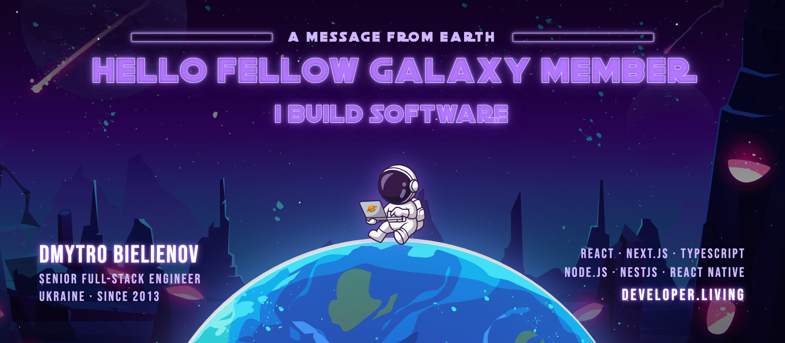
</a>

  

  
  
  
  
  
  

<table>
  <tr>
    <td width="220" align="center" valign="middle">
      
       
      
    </td>
    <td valign="middle">
      

        <b>Senior Full-Stack Engineer in Ukraine, building web products since 2013.</b>
        Frontend first — React and Next.js — and at home across the stack with Node.js, NestJS and PostgreSQL when the product needs it.
      

      

        Complex systems from architecture to production support, with a strong focus on testing (Cypress, Playwright, Storybook), code review and mentoring — and Claude Code and Codex every day to ship faster without lowering the bar. In my spare time I write on Medium and take courses.
      

      

        🛰️ &nbsp;Full-Stack Developer at <b>ITRDev</b> since March 2023 
        🧭 &nbsp;Making <a href="https://fsd-guard.developer.living"><b>FSD Guard</b></a> — the architecture linter that lives in your Pull Request 
        📱 &nbsp;Two Android apps on Google Play and four open-source UI packages on npm 
        ✍️ &nbsp;Latest post: <a href="https://medium.com/@dimabelenov/fsd-is-easy-to-start-and-hard-to-keep-fe9a4de8f5ca">FSD is easy to start and hard to keep</a>
      

    </td>
  </tr>
</table>

 

<a href="https://www.developer.living/projects">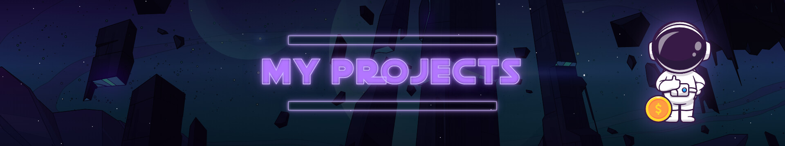</a>

### 🧭 FSD Guard &nbsp;Chrome & VS Code extension

<a href="https://fsd-guard.developer.living">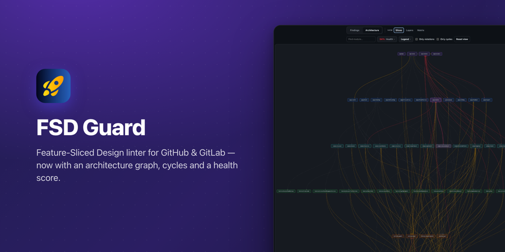</a>

**The architecture linter that lives in your Pull Request.** Feature-Sliced Design rules live in people's heads, and a reviewer skimming a 300-line diff misses the import that reaches into another slice. FSD Guard checks them where the code is read: inside the Pull or Merge Request on GitHub and GitLab, across the whole repository in one click, and in VS Code as you type. No CI, no ESLint plugin, no setup in the project — nothing leaves the browser.

  
  
  
  

  
   <b>FSD Guard in 35 seconds</b> — a PR check, the dependency graph, tracing a module, Layers & Matrix, the health score

| 🔍 Pull Request check | 🗺️ Architecture graph | 🩺 Cycles & health score |
| :-- | :-- | :-- |
| Violations in the added lines, highlighted inline in the diff with why it's wrong and how to fix it. | Every slice laid out by layer; upward and cross-slice imports light up, edge thickness is the import count. | Circular dependencies, the share of clean edges, violations by type and layer, hubs and orphans. |
| **📦 Full-repository audit** | **✍️ In your editor too** | **🤖 Copy for AI** |
| One click scans every source file in the browser and groups the report by file. | Squiggles as you type, hovers that explain, quick fixes and a whole-workspace scan. | Findings exported as a prompt for ChatGPT, Claude or Copilot, with an architecture overview. |

<b>📸 Screenshots</b>

 
<table>
  <tr>
    <td width="50%">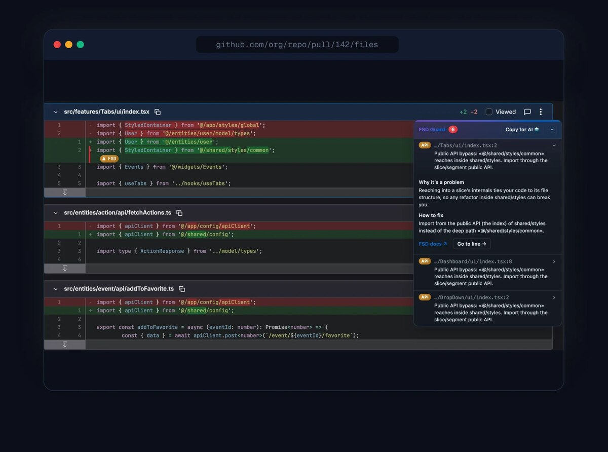 <b>Review inside the PR</b> — the details panel explains why and how to fix it</td>
    <td width="50%">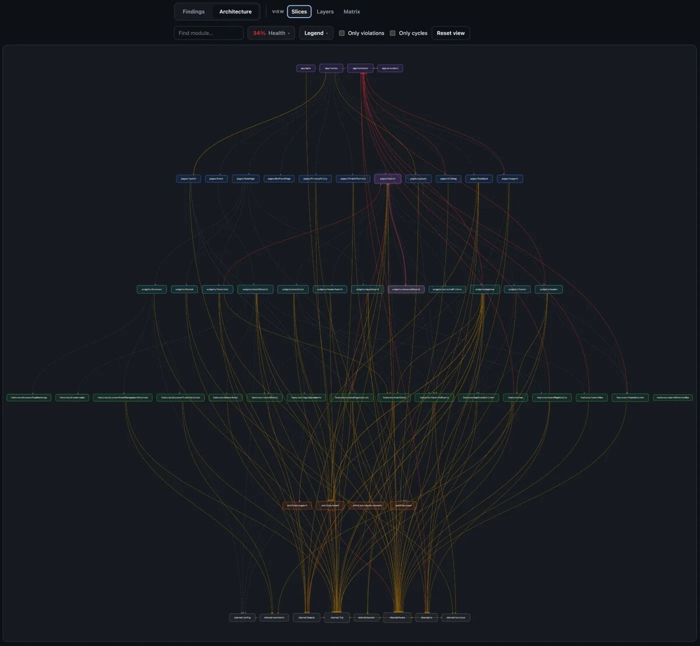 <b>Dependency graph</b> — violating imports solid and colour-coded</td>
  </tr>
  <tr>
    <td>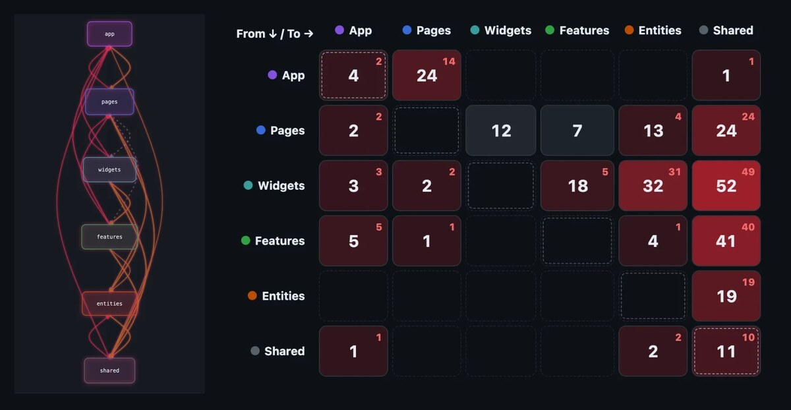 <b>Layers & Matrix</b> — red cells hold violations</td>
    <td>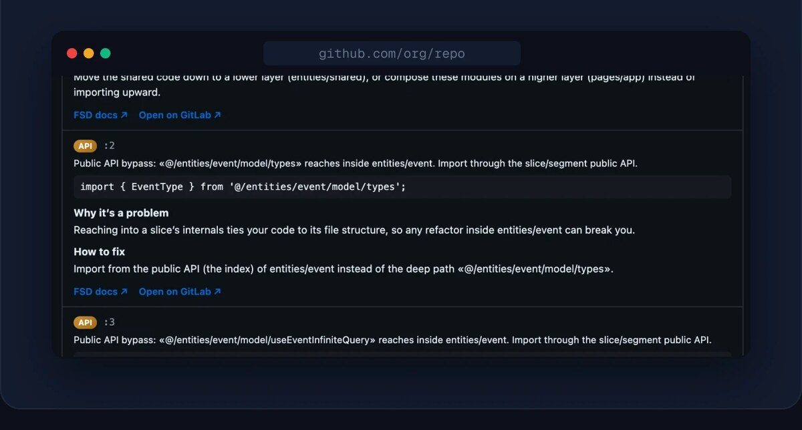 <b>Repository audit</b> — every violation, listed by file</td>
  </tr>
  <tr>
    <td>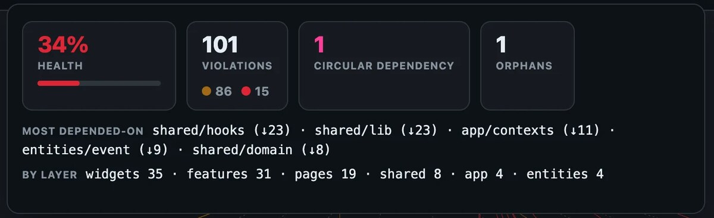 <b>Health, cycles & hotspots</b></td>
    <td align="center">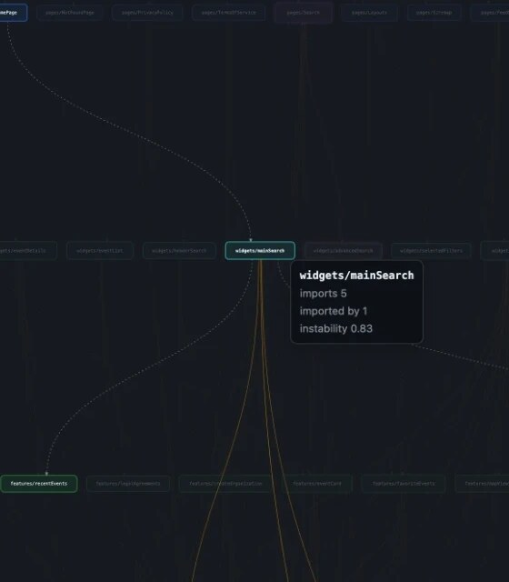 <b>Trace any module</b> — what it imports, who imports it</td>
  </tr>
</table>

**Stack:** TypeScript · Manifest V3 · 6 languages &nbsp;·&nbsp; **Runs on:** Chrome · VS Code · GitHub · GitLab

 

<table>
  <tr>
    <td width="50%" valign="top">
      <h3>💳 Cardfold &nbsp;Android app</h3>
      <a href="https://cardfold.developer.living">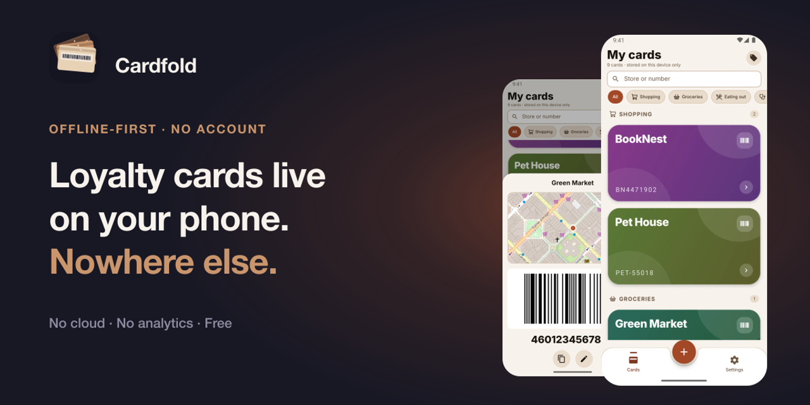</a>
      
<b>Your loyalty cards live on your phone. Nowhere else.</b> An offline wallet for loyalty cards: scan the barcode once, show it at the till — the screen turns itself up so the scanner reads it first time. No account, no cloud, no analytics.

      

        
        
      

      
       10 barcode formats · reminders before a card expires · pin a card to a shop on the map · five themes, light and dark · fingerprint lock · widget · EN / UK / RU
       <b>Stack:</b> React Native · Expo · TypeScript · MMKV
    </td>
    <td width="50%" valign="top">
      <h3>💧 DrinkUp &nbsp;Android app</h3>
      <a href="https://drinkup.developer.living">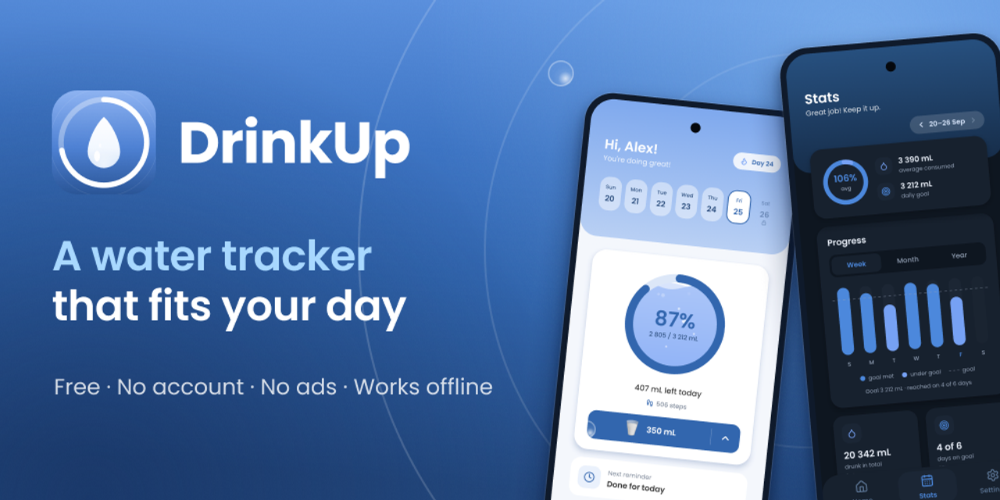</a>
      
<b>A water tracker that fits your day.</b> Works out your daily goal from your weight, activity, waking hours and meals, reminds you only while you are up, and logs a glass in one tap. No account, no ads, everything on the phone.

      

        
        
      

      
       A goal with the arithmetic shown · twelve drinks counted honestly · stats & streaks · widgets · Health Connect · EN / UK / RU
       <b>Stack:</b> React Native · Expo · TypeScript · Health Connect
    </td>
  </tr>
</table>

<b>📱 App screenshots</b>

 

  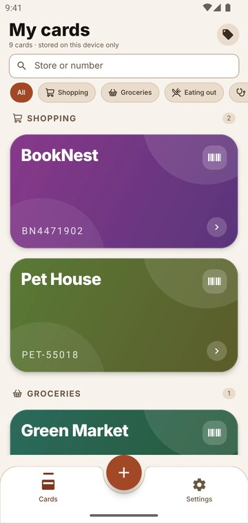
  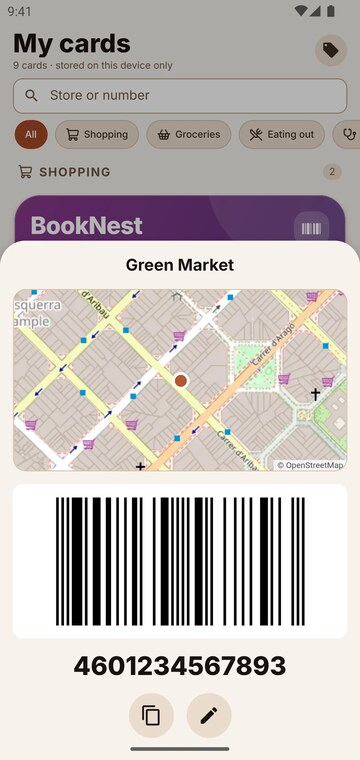
  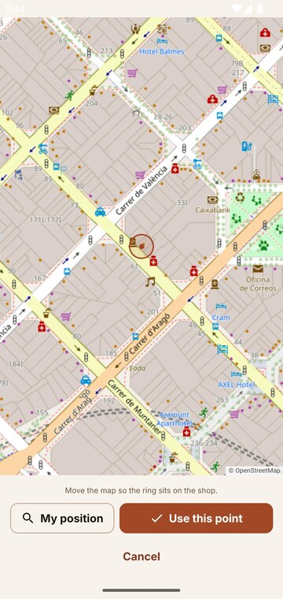
  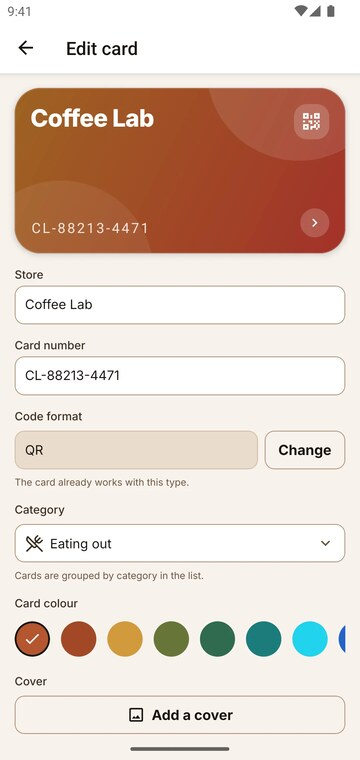
  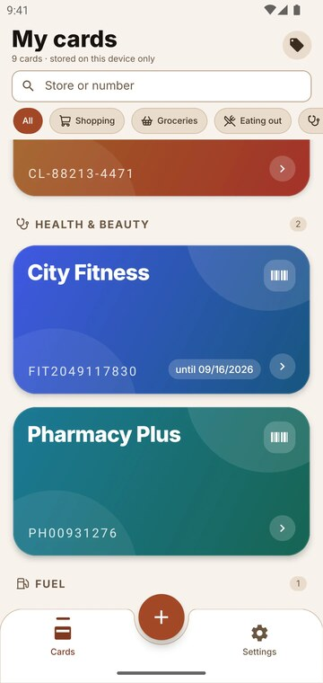
  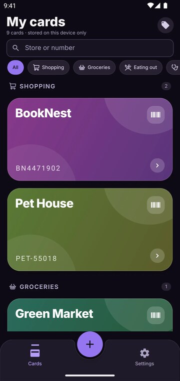

  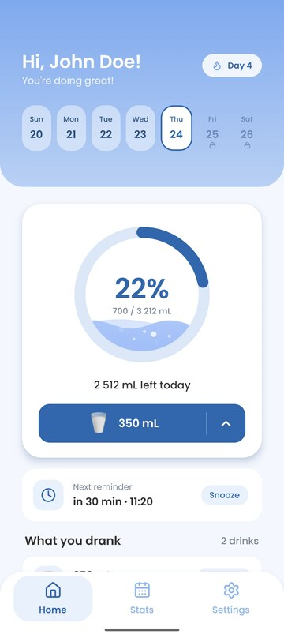
  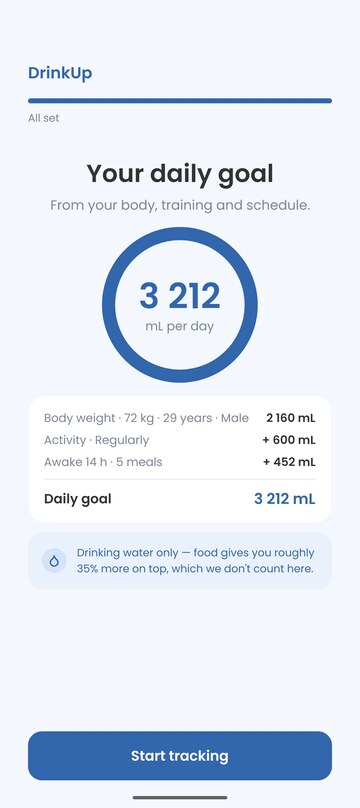
  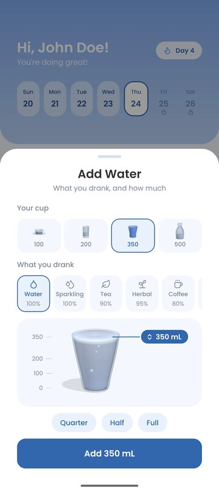
  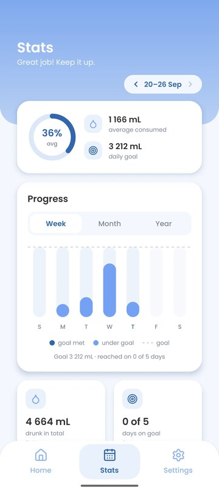
  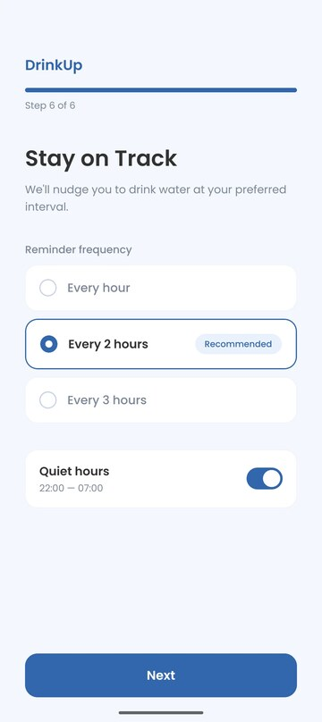
  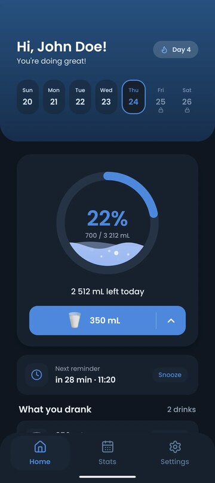

 

<i>Three were pulled out of DrinkUp, the fourth brings the swipe to the web — all typed, accessible and on npm.</i>

<table>
  <tr>
    <td width="50%" valign="top" align="center">
      
      <h3><a href="https://github.com/nahkar/react-native-full-swipe">Full Swipe</a></h3>
      
<b>One swipe. Any action, on either side.</b> Full-swipe rows for React Native: delete, archive or mark as read past a threshold you can feel, with an undo bar for the swipe you didn't mean.

      
      
       Reanimated · Gesture Handler · Expo
    </td>
    <td width="50%" valign="top" align="center">
      
      <h3><a href="https://github.com/nahkar/react-native-wheel-kit">Wheel Kit</a></h3>
      
<b>Wheel pickers that feel the same on iOS and Android.</b> A snapping WheelPicker plus TimePicker and DatePicker: a haptic tick per row, virtualised for long lists, any locale.

      
      
       Reanimated · Expo
    </td>
  </tr>
  <tr>
    <td width="50%" valign="top" align="center">
      
      <h3><a href="https://github.com/nahkar/react-native-liquid-fill">Liquid Fill</a></h3>
      
<b>Progress that sloshes when you tilt the phone.</b> Water that fills any shape — circle, card, bottle, any SVG path — with travelling waves, rising bubbles and a surface that stays level.

      
      
       Reanimated worklets · react-native-svg · Expo
    </td>
    <td width="50%" valign="top" align="center">
      
      <h3><a href="https://github.com/nahkar/swipe-row">Swipe Row</a></h3>
      
<b>Swipeable rows for React on the web.</b> Reveal buttons like iOS Mail or full-swipe like Telegram and Gmail — or both in one row. Keyboard and screen-reader friendly, ~5 kB.

      
      
       React · Pointer Events · zero dependencies
    </td>
  </tr>
</table>

 

  

| | |
| :-- | :-- |
| **🎨 Frontend** | `React` `Next.js` `TypeScript` `JavaScript` `Tailwind CSS` `shadcn/ui` `Styled-Components` `Zustand` `Zod` `Apollo / GraphQL` `Feature-Sliced Design` |
| **🛠️ Backend** | `Node.js` `NestJS` `Express` `GraphQL` `PostgreSQL` `Prisma` `Drizzle ORM` `MongoDB` `Docker` |
| **📱 Mobile** | `React Native` `Flutter` `Capacitor` |
| **📊 Data & ML** | `Python` `Django` `pandas` `NumPy` `scikit-learn` `matplotlib` |
| **🧪 Testing** | `Cypress` `Playwright` `Unit & integration testing` `Storybook` |
| **🤖 AI tools** | `Claude Code` `Codex` `LLMs` `Generative AI` |
| **🗂️ Process & tools** | `Scrum` `Kanban` `Jira` `Linear` `Confluence` `Notion` `Slack` `GitHub / GitLab` `Figma` |
| **🧠 Practices** | `Code review` `Clean architecture` `Performance optimization` `Testing` `Mentoring` |

 

<table>
  <tr>
    <td width="170" valign="top"><b>Mar 2023 — now</b> Ukraine · Remote</td>
    <td valign="top">
      <b>Full-Stack Developer · ITRDev</b> 
      Features end to end — from requirements and technical design to release and production support — across a Next.js front end and a NestJS back end. The place FSD Guard grew out of.
      <ul>
        <li>Next.js and TypeScript front ends: SSR/SSG, Zustand, Apollo / GraphQL, Zod and a shared component library.</li>
        <li>NestJS services and APIs with DTO validation, auth and role-based access; PostgreSQL through Prisma and Drizzle.</li>
        <li>Cypress and Playwright end-to-end tests on every pull request, unit and integration tests, Storybook for the UI library.</li>
        <li>Code reviews, onboarding, architecture decisions; performance work on bundle size, Core Web Vitals and API response times.</li>
      </ul>
      <code>React</code> <code>Next.js</code> <code>TypeScript</code> <code>NestJS</code> <code>PostgreSQL</code> <code>Prisma</code> <code>Drizzle</code> <code>GraphQL</code> <code>Playwright</code> <code>Cypress</code> <code>Storybook</code>
    </td>
  </tr>
  <tr>
    <td valign="top"><b>Jul 2022 — Mar 2023</b> Ukraine · Remote</td>
    <td valign="top">
      <b>Software Engineer · Seeking Alpha</b> 
      Frontend features end to end — website features, mobile web screens and landing pages in React and TypeScript. Interactive charts, tables and ad hoc reports for financial data; reusable typed components; code splitting, lazy loading and fewer re-renders with an eye on Core Web Vitals.
       <code>React</code> <code>TypeScript</code> <code>JavaScript</code> <code>SCSS</code> <code>Figma</code>
    </td>
  </tr>
  <tr>
    <td valign="top"><b>Jul 2015 — May 2022</b> Ukraine · On-site</td>
    <td valign="top">
      <b>Full-Stack Developer · CHI Software</b> 
      Nearly seven years on full-stack web applications that processed, analysed and visualised data — from the database schema and API to the UI. GraphQL APIs in Node.js, Express and NestJS; React dashboards with Apollo Client; cross-platform apps with Capacitor.
       <code>Node.js</code> <code>NestJS</code> <code>Express</code> <code>React</code> <code>GraphQL</code> <code>PostgreSQL</code> <code>MongoDB</code> <code>Capacitor</code> <code>Cypress</code> <code>Storybook</code>
    </td>
  </tr>
  <tr>
    <td valign="top"><b>Sep 2013 — Jul 2015</b> Ukraine · On-site</td>
    <td valign="top">
      <b>Frontend Developer · W3</b> 
      Websites, hybrid mobile apps and landing pages from concept through deployment: pixel-perfect, cross-browser, mobile-first markup and Apache Cordova apps wired into native device features.
       <code>JavaScript</code> <code>jQuery</code> <code>HTML/CSS</code> <code>Apache Cordova</code>
    </td>
  </tr>
</table>

 

| Certificate | Issuer | Issued |
| :-- | :-- | :-- |
| 🎓 [Claude Academy: AI Fluency for Builders](https://academy.claude.com/verify/affac20b9669302d0c760fad875c45b6) | Anthropic | Sep 2026 |
| 🎓 [Python, Django, Data Science, ML](https://www.udemy.com/certificate/UC-6150609e-dd85-4133-b4f8-913396e82552/) | Udemy | Mar 2026 |
| 🎓 [Generative AI](https://www.udemy.com/certificate/UC-d4e3e30d-b607-4855-8b66-958051bc13a2/) | Udemy | Feb 2026 |
| 🎓 [GraphQL with React: The Complete Developers Guide](https://www.udemy.com/certificate/UC-26b42c49-b023-490b-bd7a-156c1ffeca6c/) | Udemy | Jul 2025 |
| 🎓 [Go — The Complete Guide](https://www.udemy.com/certificate/UC-770b29ab-d54e-419e-9780-452684425c21/) | Udemy | Dec 2024 |
| 🎓 [SQL and PostgreSQL: The Complete Developer's Guide](https://www.udemy.com/certificate/UC-4e8ff41e-91c1-415e-810f-43a357ab4789/) | Udemy | Oct 2024 |
| 🎓 [Node JS: Advanced Concepts](https://www.udemy.com/certificate/UC-72e8823b-3180-427a-8475-6b9913b8856e/) | Udemy | Sep 2024 |

<b>…and four more</b>

 

| Certificate | Issuer | Issued |
| :-- | :-- | :-- |
| 🎓 [NestJS: The Complete Developer's Guide](https://www.udemy.com/certificate/UC-7e25f8a6-5262-441b-b6d2-da3d7c2e0dad/) | Udemy | May 2022 |
| 🎓 MongoDB — M001: MongoDB Basics | MongoDB University | Feb 2022 |
| 🎓 [Python — The Practical Guide](https://www.udemy.com/certificate/UC-1d37e89a-db80-48d3-bab8-903b39049453/) | Udemy | Feb 2022 |
| 🎓 [Microservices with Node JS and React](https://www.udemy.com/certificate/UC-a32455ec-1bcf-4e6a-8aba-e4ddc33bfd8a/) | Udemy | Feb 2022 |

 

<!-- BLOG-POST-LIST:START -->
- **[FSD is easy to start and hard to keep](https://medium.com/@dimabelenov/fsd-is-easy-to-start-and-hard-to-keep-fe9a4de8f5ca?source=rss-e3ff5526457e------2)** · Jul 20, 2026
- **[Pattern Mapper in JavaScript](https://medium.com/@dimabelenov/pattern-mapper-in-javascript-12bafa650495?source=rss-e3ff5526457e------2)** · Feb 24, 2023
- **[How global TypeScript utilities work under the hood — Readonly&lt;Type&gt;](https://medium.com/@dimabelenov/how-global-typescript-utilities-work-under-the-hood-readonly-type-244230b6c725?source=rss-e3ff5526457e------2)** · Jan 24, 2022
- **[How global TypeScript utilities work under the hood — Required&lt;Type&gt;](https://medium.com/@dimabelenov/how-global-typescript-utilities-work-under-the-hood-required-type-b62547900521?source=rss-e3ff5526457e------2)** · Jan 22, 2022
- **[How global TypeScript utilities work under the hood — Partial&lt;Type&gt;](https://medium.com/@dimabelenov/how-global-typescript-utilities-work-under-the-hood-partial-type-f868a31234bc?source=rss-e3ff5526457e------2)** · Jan 21, 2022<!-- BLOG-POST-LIST:END -->

 

  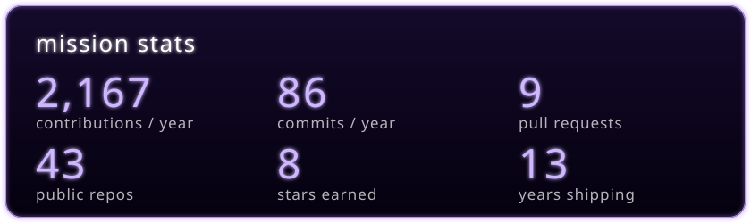

  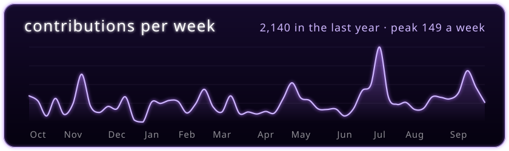

  

  

 

  
  
  

Banners are drawn from the <a href="https://www.developer.living">developer.living</a> scenes by <a href="banners/render.mjs"><code>banners/render.mjs</code></a>; the stats cards are redrawn every day by <a href="scripts/stats.mjs"><code>scripts/stats.mjs</code></a>.

